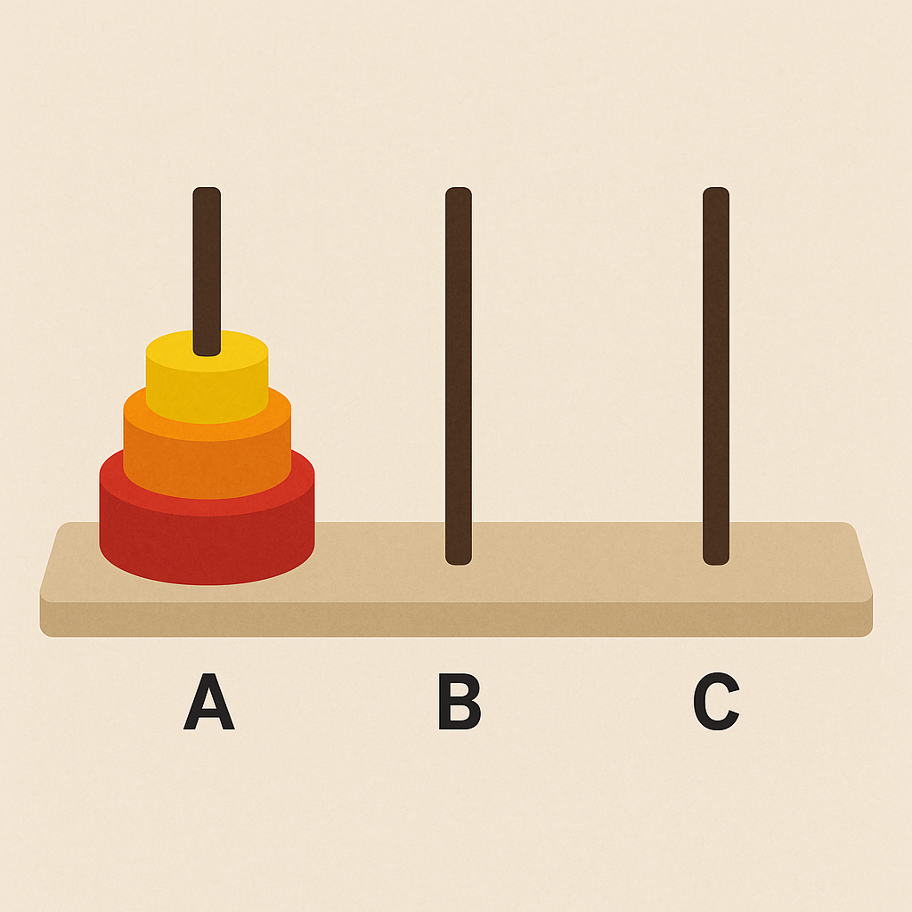

# torre_hanoi

A ideia proposta é uma lógica com três torres, sob os quais o disco será movido, conforme o algoritmo de torre de hanoi em forma recursiva.Logo, a torre A será a torre de origem, a torre B será a torre de destino, e a torre C será a torre auxiliar. Conforme a imagem para ideia.
        

Com essa imagem fica mais visual, seguindo a ideia em que discos menores não podem ser colocados por baixo dos maiores, no caso do algoritmo segue a ideia de disco      
        
        disco 1 < disco 2 < disco 3 < disco n-1 <...

 Por isso é necessário a recursão para elaborar lógica mais simples. Principalmente levandoi em consideração a lógica do empilhamento e desempilhamento de discos.Sendo o disco n na base.
 Um exemplo cm entrada de 3 discos seria:

            torre_hanoi(3,'A','B','C');
            A- origem
            B-destino
            C-auxiliar

            ### RESULTADO ###
            Move disco 1 de A para B.
            Move disco 2 de A para C.
            Move disco 1 de B para C.
            Move disco 3 de A para B.
            Move disco 1 de C para A.
            Move disco 2 de C para B.
            Move disco 1 de A para B.

## english version

The proposed idea is a logic with three towers, through which the disks will be moved, following the Tower of Hanoi algorithm recursively. Thus, tower A will be the source tower, tower B will be the destination tower, and tower C will be the auxiliary tower, as shown in the illustration below.

     

With this image, the concept becomes more visual, emphasizing the rule that smaller disks cannot be placed below larger disks. The algorithm follows the idea that:

    disk 1 < disk 2 < disk 3 < ... < disk n

Therefore, recursion is necessary to develop a simpler logic, especially considering the process of stacking and unstacking disks, with disk n always at the base.

An example with an input of 3 disks would be:

        torre_hanoi(3, 'A', 'B', 'C');
        Where:

        A → source

        B → destination

        C → auxiliary

        ## RESULT ##
        Move disk 1 from A to B.
        Move disk 2 from A to C.
        Move disk 1 from B to C.
        Move disk 3 from A to B.
        Move disk 1 from C to A.
        Move disk 2 from C to B.

